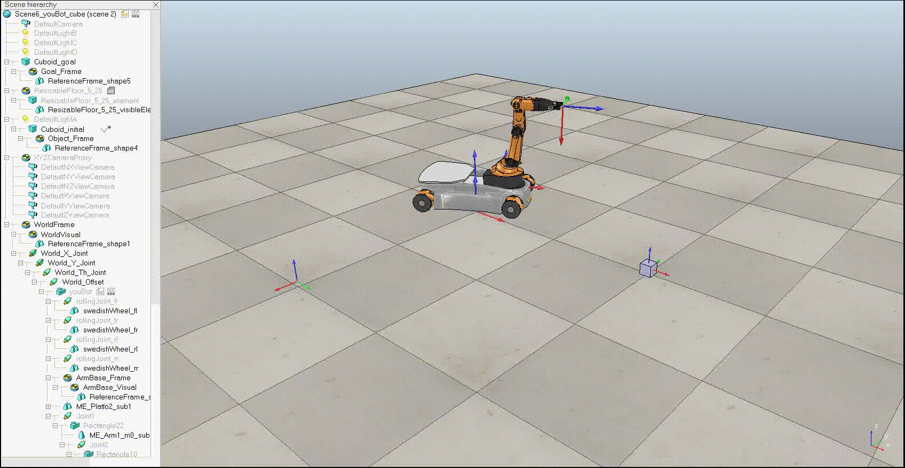

# Mobile-Manipulator Capstone Project

## Overview
This project implements a mobile-manipulator robot control system through a series of Python scripts, organized into milestones. Each script handles specific functionalities, from state prediction to trajectory generation and control. The project includes six main files, described below, along with instructions for executing a new task and achieving overshoot behavior.

## Files and Milestones

### Milestone 1: State Prediction
- **File**: `nextState.py`
- **Description**: Predicts the next state of the robot given its initial configuration and current speeds. The `NextState` function returns a 12-element vector representing the new state. It utilizes helper functions `NextStateWheels` and `AngleUpdate` to compute the robot's next state based on wheel and joint dynamics.

### Milestone 2: Trajectory Generation
- **Files**:
  - `timing_calc.py`
  - `trajectory_generator.py`
- **Description**:
  - `timing_calc.py`: Calculates the time duration and sequence of operations for the robot's trajectory.
  - `trajectory_generator.py`: Generates a screw trajectory based on the timing calculations and saves the results to a CSV file.

### Milestone 3: Control Systems
- **File**: `feedback_control.py`
- **Description**: Implements feedforward and feedback control for the robot. The script computes the Jacobian matrix (6xN), incorporating both the arm and base dynamics. The `FeedbackControl` function returns the robot's speed commands and error values.

### Execution
- **File**: `final_code.py`
- **Description**: Executes the control pipeline and generates CSV files containing the 13-element state vector, which includes wheel angles, joint angles, robot position, and gripper state.

### Variable Definitions
- **File**: `variables.py`
- **Description**: Defines matrices and variables used across the project. Each variable is documented within the script for clarity.

## New Task Configuration
To perform the new task, modify the following in `timing_calc.py`:
- Set `Tsc_init` to `robot.Tsc_init_2`.
- Set `Tsc_final` to `robot.Tsc_final_2`.

## Overshoot Behavior
To achieve overshoot in the control system, update the gain values in `variables.py`:
- Set the proportional gain (`P`) to `2`.
- Set the integral gain (`I`) to `5`.

## Usage
1. Ensure all dependencies are installed (refer to `variables.py` for required libraries or configurations).
2. Run `final_code.py` to execute the full pipeline and generate the state trajectory CSV files.
3. For the new task, update `timing_calc.py` as described above.
4. For overshoot, adjust the gain values in `variables.py` as specified.